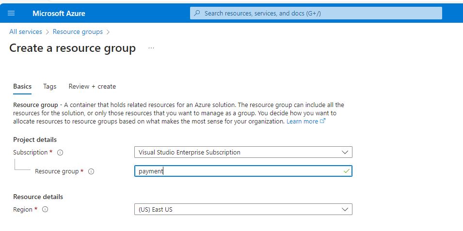

# Day-03

---

- A resource is an instance of a service
- Whenver we are create a service is called resouces
-

`
  User---> DevOps --> VMS-->Create-->ARM-->Linux/Windows VM ---> User
`

- - User at first create a JIRA ticket
- - whatver we have ci/cl it goes to the AZM ( Azure Resouces Manager )

## Resouce Group

- Grouping of Resources ( we can track easily )
- combination of resources

## Createing Resouce Group

## Relation of Resource Grouph and Resources

- it's 1 to  1 relationship

### sum-up

- Resouces
- Resources Manger- responsible for creating the resouces
- Reource Group - Grouping of Resouces
