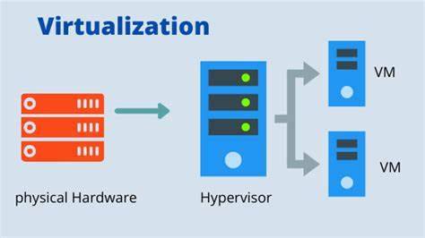
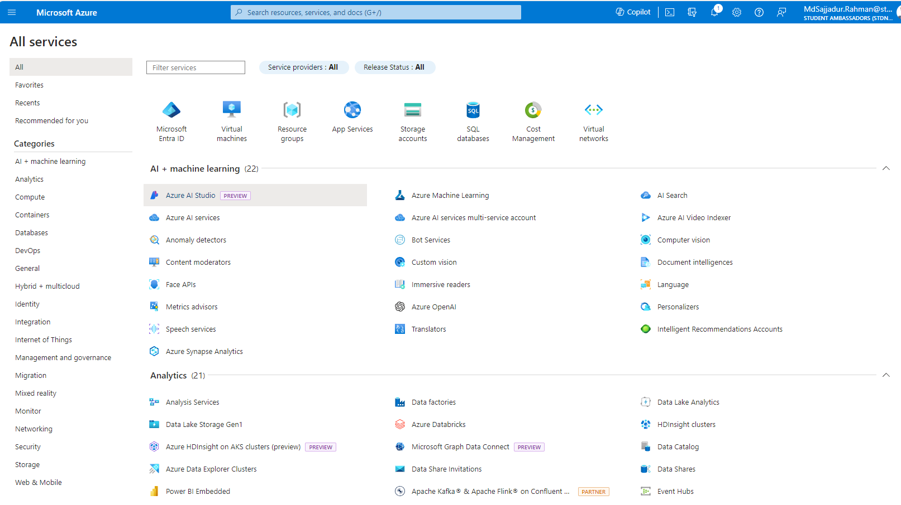

# Azure Virtual Machines

## Virtualization

- - -
Imagine I have a physical server which has 1000 cpus and 1000 TB . If i have hire another developer from the other country how do I give the access . Well , i can install a `Hypervisor` which divide logically devide it into separte parts and where we can assign dedicated developer ( dev-1 , dev-2 , dev-3  ----- dev-n)

here is the Graphical view of virtualization

- Create a Virtual Machine . We have to go the homepage of Azure

to know more about resources group and sevices of az-900 must flow this MS learn ( AZ-900)
